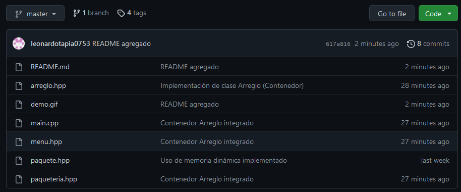

# Paqueteria

Código trabajado en sesiones de clase de la materia Seminario de Solución de Problemas de Estructuras de Datos I.

Utiliza los tags para ver las diferentes versiones del código según la fecha de sesión de clase:

